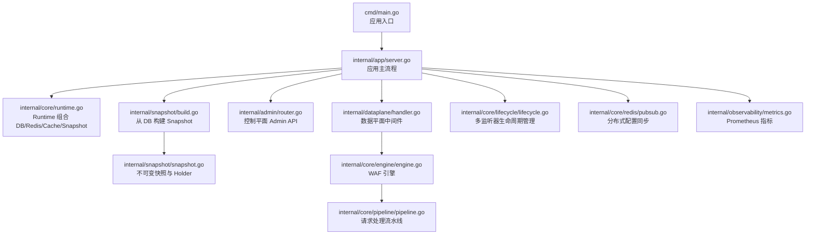
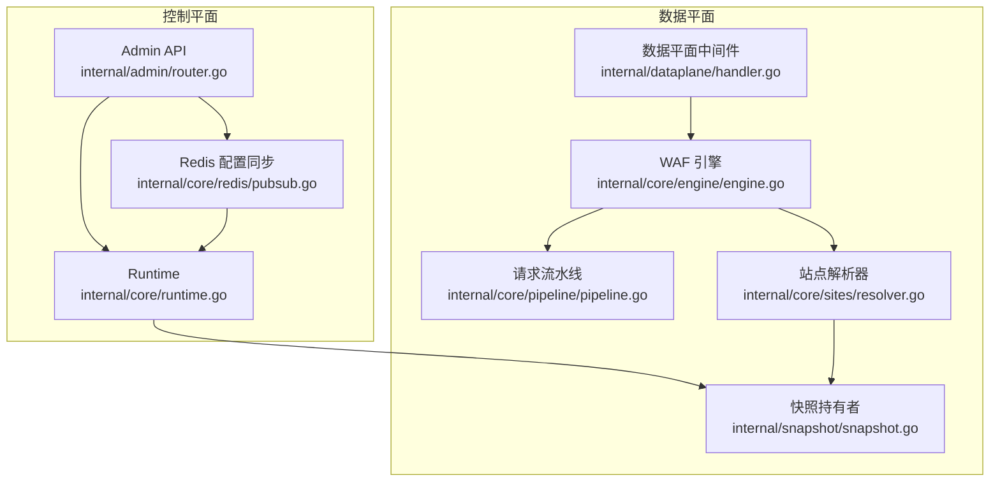
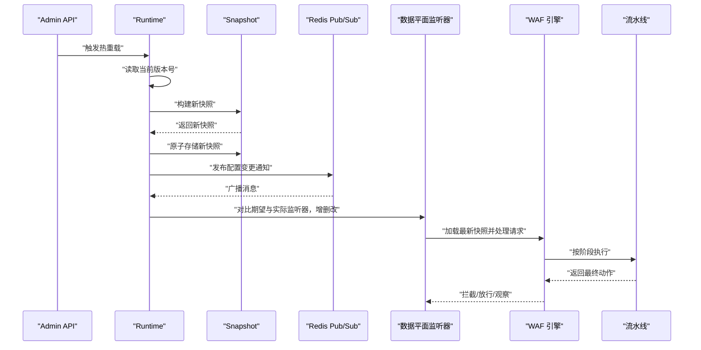
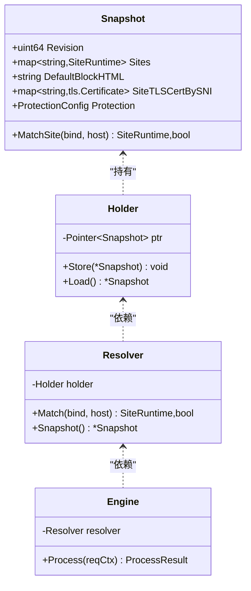
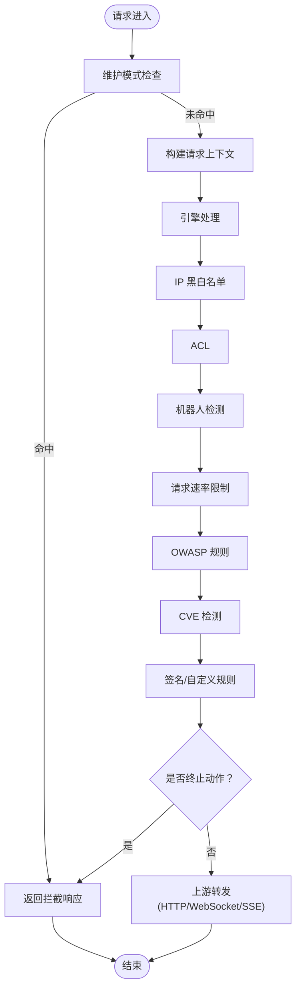
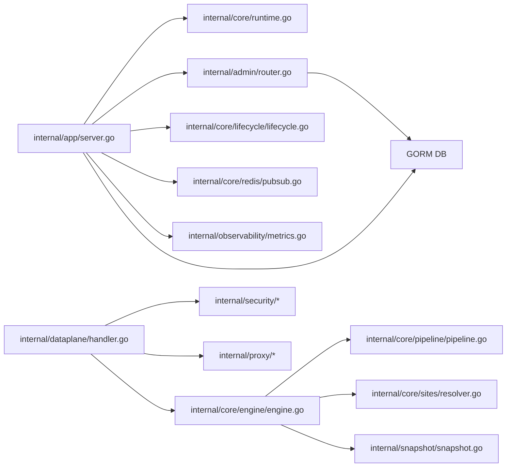

# 技术架构

<cite>
**本文引用的文件**   
- [cmd/main.go](file://cmd/main.go)
- [internal/app/server.go](file://internal/app/server.go)
- [internal/core/runtime.go](file://internal/core/runtime.go)
- [internal/snapshot/snapshot.go](file://internal/snapshot/snapshot.go)
- [internal/snapshot/build.go](file://internal/snapshot/build.go)
- [internal/core/engine/engine.go](file://internal/core/engine/engine.go)
- [internal/core/pipeline/pipeline.go](file://internal/core/pipeline/pipeline.go)
- [internal/core/sites/resolver.go](file://internal/core/sites/resolver.go)
- [internal/admin/router.go](file://internal/admin/router.go)
- [internal/dataplane/handler.go](file://internal/dataplane/handler.go)
- [internal/core/lifecycle/lifecycle.go](file://internal/core/lifecycle/lifecycle.go)
- [internal/core/redis/pubsub.go](file://internal/core/redis/pubsub.go)
- [internal/observability/metrics.go](file://internal/observability/metrics.go)
- [internal/waf/ratelimit.go](file://internal/waf/ratelimit.go)
- [internal/store/models.go](file://internal/store/models.go)
</cite>

## 目录
1. [引言](#引言)
2. [项目结构](#项目结构)
3. [核心组件](#核心组件)
4. [架构总览](#架构总览)
5. [详细组件分析](#详细组件分析)
6. [依赖关系分析](#依赖关系分析)
7. [性能考量](#性能考量)
8. [故障排查指南](#故障排查指南)
9. [结论](#结论)
10. [附录](#附录)

## 引言
本文件面向 My-OpenWaf 的技术架构与实现，聚焦于“控制平面 + 数据平面”的双服务器架构设计理念，系统性阐述快照模式（Snapshot）的不可变配置管理与原子指针切换机制，以及引擎处理流水线（Pipeline）在请求路径上的执行顺序与短路策略。文档还总结了 AdminAPI、AppServer、Engine、Snapshot 等核心组件之间的关系与数据流，并给出关键设计模式（工厂模式、管道模式）的应用示例与可视化图示，帮助读者快速理解系统选型与运行机制。

## 项目结构
My-OpenWaf 采用分层与功能域结合的组织方式：
- cmd：应用入口，调用 internal/app 的 Run 启动服务
- internal/app：应用主流程，负责初始化 Runtime、构建 Snapshot、启动控制平面与数据平面监听器、生命周期管理
- internal/core：核心子系统（引擎、规则、站点解析、生命周期、管道、缓存、数据库、Redis、健康检查、可观测）
- internal/admin：控制平面的 REST API 与前端静态资源挂载
- internal/dataplane：数据平面中间件与上游代理逻辑
- internal/snapshot：快照构建与不可变视图
- internal/waf：WAF 规则与防护能力（速率限制、IP 黑白名单、机器人检测、CVE 检测等）
- internal/store：持久化模型与系统设置
- internal/observability：事件写入、归档与 Prometheus 指标导出
- frontend：前端 SPA（非本文重点）

图表来源
- [cmd/main.go:1-10](file://cmd/main.go#L1-L10)
- [internal/app/server.go:35-300](file://internal/app/server.go#L35-L300)
- [internal/core/runtime.go:17-99](file://internal/core/runtime.go#L17-L99)
- [internal/snapshot/build.go:14-143](file://internal/snapshot/build.go#L14-L143)
- [internal/snapshot/snapshot.go:52-105](file://internal/snapshot/snapshot.go#L52-L105)
- [internal/admin/router.go:33-179](file://internal/admin/router.go#L33-L179)
- [internal/dataplane/handler.go:36-257](file://internal/dataplane/handler.go#L36-L257)
- [internal/core/engine/engine.go:15-128](file://internal/core/engine/engine.go#L15-L128)
- [internal/core/pipeline/pipeline.go:25-66](file://internal/core/pipeline/pipeline.go#L25-L66)
- [internal/core/lifecycle/lifecycle.go:30-178](file://internal/core/lifecycle/lifecycle.go#L30-L178)
- [internal/core/redis/pubsub.go:13-77](file://internal/core/redis/pubsub.go#L13-L77)
- [internal/observability/metrics.go:13-126](file://internal/observability/metrics.go#L13-L126)

章节来源
- [cmd/main.go:1-10](file://cmd/main.go#L1-L10)
- [internal/app/server.go:35-300](file://internal/app/server.go#L35-L300)

## 核心组件
- AppServer（应用主流程）
  - 初始化 Runtime（DB/Redis/Cache/Snapshot），自动迁移与种子数据，构建初始 Snapshot
  - 启动控制平面 Admin API 与多个数据平面监听器（按站点维度热启/重启）
  - 热重载：变更系统设置或规则后，通过 Redis Pub/Sub 广播，节点间一致地重建 Snapshot 并热更新监听器
- AdminAPI（控制平面）
  - 提供认证、RBAC、站点/规则/证书/IP 列表/保护设置等管理接口
  - 支持 Snapshot 热重载触发点
- Engine（WAF 引擎）
  - 基于不可变 Snapshot 进行站点匹配与规则编译，构建流水线并执行
  - 支持维护模式、IP 黑白名单、机器人检测、OWASP 规则、CVE 检测、速率限制等阶段
- Snapshot（快照）
  - 不可变视图，使用原子指针进行安全切换；包含站点映射、保护配置、SNI 证书等
- DataPlane（数据平面）
  - Hertz 中间件，负责客户端 IP 解析、请求上下文构建、WAF 处理、拦截响应、上游转发
- Lifecycle（生命周期）
  - 统一管理多个 Hertz 服务器的启动、停止、信号处理与配置漂移检测
- Redis 配置同步
  - Pub/Sub 广播配置变更，确保多节点一致性
- Observability（可观测）
  - 安全事件异步写入、归档、Prometheus 指标导出

章节来源
- [internal/app/server.go:35-300](file://internal/app/server.go#L35-L300)
- [internal/admin/router.go:33-179](file://internal/admin/router.go#L33-L179)
- [internal/core/engine/engine.go:15-128](file://internal/core/engine/engine.go#L15-L128)
- [internal/snapshot/snapshot.go:52-105](file://internal/snapshot/snapshot.go#L52-L105)
- [internal/dataplane/handler.go:36-257](file://internal/dataplane/handler.go#L36-L257)
- [internal/core/lifecycle/lifecycle.go:30-178](file://internal/core/lifecycle/lifecycle.go#L30-L178)
- [internal/core/redis/pubsub.go:13-77](file://internal/core/redis/pubsub.go#L13-L77)
- [internal/observability/metrics.go:13-126](file://internal/observability/metrics.go#L13-L126)

## 架构总览
My-OpenWaf 采用“控制平面 + 数据平面”的双服务器架构：
- 控制平面（Admin API）：提供认证、RBAC、配置变更与热重载触发
- 数据平面（多监听器）：每个站点绑定地址组合对应独立 Hertz 实例，支持按站点启停与热重启

快照模式（Snapshot）是系统的核心配置载体：
- 不可变：从数据库构建后不再修改，保证并发读取安全
- 原子切换：通过 Holder 的原子指针在全局共享，避免锁竞争
- 快速回滚：失败时可立即回退到上一个有效快照

图表来源
- [internal/admin/router.go:33-179](file://internal/admin/router.go#L33-L179)
- [internal/core/runtime.go:82-99](file://internal/core/runtime.go#L82-L99)
- [internal/core/redis/pubsub.go:33-68](file://internal/core/redis/pubsub.go#L33-L68)
- [internal/dataplane/handler.go:36-106](file://internal/dataplane/handler.go#L36-L106)
- [internal/core/engine/engine.go:56-128](file://internal/core/engine/engine.go#L56-L128)
- [internal/core/sites/resolver.go:18-31](file://internal/core/sites/resolver.go#L18-L31)
- [internal/snapshot/snapshot.go:98-105](file://internal/snapshot/snapshot.go#L98-L105)

## 详细组件分析

### 双服务器架构与数据流向
- 控制平面
  - Admin API 接收配置变更请求，调用 Runtime.ReloadSnapshot 重建快照
  - 通过 Redis Pub/Sub 广播“配置已变更”，其他节点订阅后执行相同流程
  - 更新速率限制与 IP 黑白名单配置，热更新所有数据平面监听器
- 数据平面
  - 每个站点绑定地址组合对应独立 Hertz 监听器，支持按站点启停
  - 请求进入中间件后，先进行维护模式判断，再交由引擎执行规则流水线
  - 流水线命中拦截动作时直接返回阻断响应；否则根据站点配置转发至上游

图表来源
- [internal/admin/router.go:158-159](file://internal/admin/router.go#L158-L159)
- [internal/core/runtime.go:82-99](file://internal/core/runtime.go#L82-L99)
- [internal/snapshot/snapshot.go:103-104](file://internal/snapshot/snapshot.go#L103-L104)
- [internal/core/redis/pubsub.go:33-68](file://internal/core/redis/pubsub.go#L33-L68)
- [internal/app/server.go:145-237](file://internal/app/server.go#L145-L237)
- [internal/dataplane/handler.go:36-106](file://internal/dataplane/handler.go#L36-L106)
- [internal/core/engine/engine.go:56-128](file://internal/core/engine/engine.go#L56-L128)

章节来源
- [internal/admin/router.go:158-159](file://internal/admin/router.go#L158-L159)
- [internal/app/server.go:145-237](file://internal/app/server.go#L145-L237)
- [internal/core/runtime.go:82-99](file://internal/core/runtime.go#L82-L99)

### 快照模式：不可变配置与原子指针切换
- 不可变视图
  - Snapshot 在构建后不被修改，所有读操作安全无锁
  - 包含站点映射、保护配置、SNI 证书等
- 原子切换
  - Holder 使用原子指针保存当前快照，读取为 O(1)，写入为原子替换
  - 引擎与中间件均通过 Holder.Load 获取最新快照，避免竞态
- 快速回滚
  - 若新快照构建失败，可立即回退到旧快照，保障服务可用性

图表来源
- [internal/snapshot/snapshot.go:52-105](file://internal/snapshot/snapshot.go#L52-L105)
- [internal/core/sites/resolver.go:7-31](file://internal/core/sites/resolver.go#L7-L31)
- [internal/core/engine/engine.go:15-36](file://internal/core/engine/engine.go#L15-L36)

章节来源
- [internal/snapshot/snapshot.go:52-105](file://internal/snapshot/snapshot.go#L52-L105)
- [internal/core/sites/resolver.go:18-31](file://internal/core/sites/resolver.go#L18-L31)
- [internal/core/engine/engine.go:56-66](file://internal/core/engine/engine.go#L56-L66)

### 数据平面处理流程与短路策略
- 请求进入中间件后，先进行维护模式判断
- 再由引擎按阶段执行流水线：IP 黑白名单 → ACL → 机器人检测 → 请求速率限制 → OWASP → CVE → 签名/自定义规则
- 任一阶段产生“终止”动作（如拦截）即短路返回；“观察”动作仅记录但不阻断
- 未拦截时根据站点配置进行上游转发（HTTP/WebSocket/SSE）

图表来源
- [internal/dataplane/handler.go:144-256](file://internal/dataplane/handler.go#L144-L256)
- [internal/core/engine/engine.go:82-128](file://internal/core/engine/engine.go#L82-L128)
- [internal/core/pipeline/pipeline.go:46-66](file://internal/core/pipeline/pipeline.go#L46-L66)

章节来源
- [internal/dataplane/handler.go:36-257](file://internal/dataplane/handler.go#L36-L257)
- [internal/core/engine/engine.go:56-128](file://internal/core/engine/engine.go#L56-L128)
- [internal/core/pipeline/pipeline.go:25-66](file://internal/core/pipeline/pipeline.go#L25-L66)

### 关键设计模式
- 工厂模式
  - Engine.New：根据快照持有者与限流器创建引擎实例
  - RateLimiter.NewRateLimiter：按窗口大小与阈值创建限流器
- 管道模式
  - Pipeline：将多个阶段（Phase）串联执行，支持短路与观察日志收集
  - Engine 将不同防护模块封装为 Phase 并顺序执行

章节来源
- [internal/core/engine/engine.go:26-36](file://internal/core/engine/engine.go#L26-L36)
- [internal/waf/ratelimit.go:24-34](file://internal/waf/ratelimit.go#L24-L34)
- [internal/core/pipeline/pipeline.go:37-66](file://internal/core/pipeline/pipeline.go#L37-L66)

## 依赖关系分析
- 组件耦合
  - AppServer 对 Runtime、Admin 路由、Lifecycle、Redis、Observability 全量依赖
  - Engine 依赖 Snapshot、Pipeline、站点解析器与 WAF 子系统
  - DataPlane 依赖 Engine、Snapshot、Proxy、Security、Observability
- 外部依赖
  - 数据库：GORM（SQL）
  - 缓存：本地层 + Redis（可选）
  - Web 框架：CloudWeGo Hertz
  - Redis：Pub/Sub 用于配置同步

图表来源
- [internal/app/server.go:35-300](file://internal/app/server.go#L35-L300)
- [internal/core/runtime.go:17-99](file://internal/core/runtime.go#L17-L99)
- [internal/admin/router.go:33-179](file://internal/admin/router.go#L33-L179)
- [internal/core/lifecycle/lifecycle.go:30-178](file://internal/core/lifecycle/lifecycle.go#L30-L178)
- [internal/core/redis/pubsub.go:13-77](file://internal/core/redis/pubsub.go#L13-L77)
- [internal/observability/metrics.go:13-126](file://internal/observability/metrics.go#L13-L126)
- [internal/dataplane/handler.go:36-257](file://internal/dataplane/handler.go#L36-L257)
- [internal/core/engine/engine.go:15-128](file://internal/core/engine/engine.go#L15-L128)
- [internal/core/pipeline/pipeline.go:25-66](file://internal/core/pipeline/pipeline.go#L25-L66)
- [internal/core/sites/resolver.go:7-31](file://internal/core/sites/resolver.go#L7-L31)
- [internal/snapshot/snapshot.go:52-105](file://internal/snapshot/snapshot.go#L52-L105)

章节来源
- [internal/app/server.go:35-300](file://internal/app/server.go#L35-L300)

## 性能考量
- 快照不可变 + 原子指针：读取零锁争用，降低并发开销
- 请求上下文池化：减少 GC 压力
- 固定窗口限流：内存占用可控，清理协程定期回收过期窗口
- 多监听器按站点拆分：便于水平扩展与资源隔离
- Prometheus 指标：便于容量规划与异常定位

## 故障排查指南
- 配置未生效
  - 检查 Admin API 是否成功触发热重载
  - 确认 Redis Pub/Sub 是否正常，其他节点是否收到“reload”消息
  - 查看 Lifecycle 日志中监听器增删改是否按预期执行
- 请求被拦截
  - 查看安全事件写入与指标统计，确认拦截来源（OWASP/CVE/规则）
  - 检查引擎流水线阶段输出与观察命中日志
- 上游错误
  - 检查上游转发日志与状态码统计
  - 关注错误速率限制计数逻辑（4xx/5xx 计数开关）
- 维护模式
  - 确认全局或站点级维护开关状态
  - 检查维护页面 HTML 与状态码配置

章节来源
- [internal/core/redis/pubsub.go:33-68](file://internal/core/redis/pubsub.go#L33-L68)
- [internal/app/server.go:145-237](file://internal/app/server.go#L145-L237)
- [internal/dataplane/handler.go:144-256](file://internal/dataplane/handler.go#L144-L256)
- [internal/observability/metrics.go:51-125](file://internal/observability/metrics.go#L51-L125)

## 结论
My-OpenWaf 通过“控制平面 + 数据平面”的清晰分层与快照模式的不可变配置管理，实现了高可用、可扩展、可观测的 WAF 系统。引擎以管道模式组织规则阶段，具备良好的可维护性与性能表现；通过 Redis Pub/Sub 的分布式配置同步，确保多节点一致性与热更新能力。整体架构在工程实践中兼顾了易用性与稳定性。

## 附录
- 关键数据模型与默认配置
  - 规则与策略、站点、系统设置、保护配置等模型定义见 store/models.go
  - 默认保护配置（如速率限制、OWASP 敏感度、登录策略等）见同文件中的默认函数

章节来源
- [internal/store/models.go:44-318](file://internal/store/models.go#L44-L318)