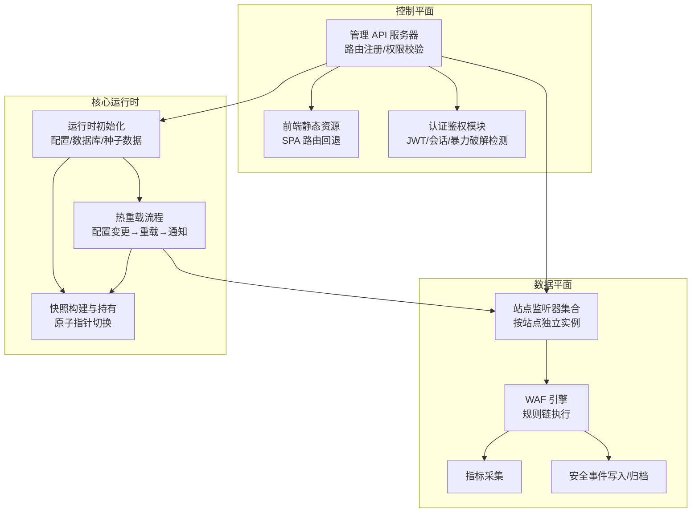
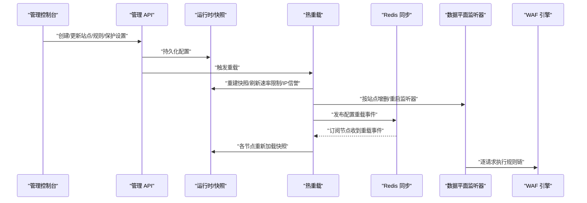
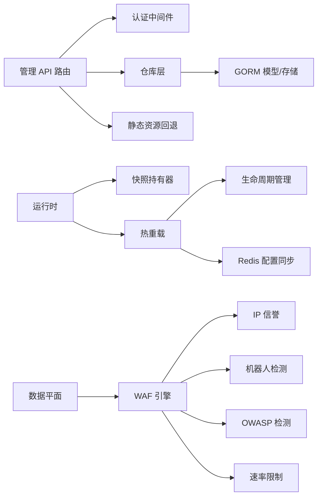

# 核心特性

<cite>
**本文引用的文件**
- [cmd/main.go](file://cmd/main.go)
- [internal/app/server.go](file://internal/app/server.go)
- [internal/core/engine/engine.go](file://internal/core/engine/engine.go)
- [internal/waf/owasp.go](file://internal/waf/owasp.go)
- [internal/waf/bot.go](file://internal/waf/bot.go)
- [internal/waf/iprep.go](file://internal/waf/iprep.go)
- [internal/core/config.go](file://internal/core/config.go)
- [internal/snapshot/snapshot.go](file://internal/snapshot/snapshot.go)
- [internal/core/lifecycle/lifecycle.go](file://internal/core/lifecycle/lifecycle.go)
- [internal/core/redis/pubsub.go](file://internal/core/redis/pubsub.go)
- [internal/admin/router.go](file://internal/admin/router.go)
- [frontend/app/layout.tsx](file://frontend/app/layout.tsx)
- [frontend/components/sidebar-nav.tsx](file://frontend/components/sidebar-nav.tsx)
- [frontend/lib/api.ts](file://frontend/lib/api.ts)
- [internal/store/models.go](file://internal/store/models.go)
</cite>

## 目录
1. [引言](#引言)
2. [项目结构](#项目结构)
3. [核心组件](#核心组件)
4. [架构总览](#架构总览)
5. [详细组件分析](#详细组件分析)
6. [依赖分析](#依赖分析)
7. [性能考虑](#性能考虑)
8. [故障排查指南](#故障排查指南)
9. [结论](#结论)
10. [附录](#附录)

## 引言
本文件面向 My-OpenWaf 项目的核心特性进行系统性概览与深入解析，围绕以下六大特性展开：多站点防护能力（多租户/多站点）、可视化管理界面（基于 Next.js 的现代化控制台）、高性能 WAF 引擎（Go 实现）、热重载配置（无停机更新）、分布式同步（多节点一致性）、全面安全防护（IP 信誉、ACL 规则、机器人检测、OWASP 检测等）。每个特性均包含实现原理、典型使用场景、优势说明，并提供可操作的配置要点与使用路径指引。

## 项目结构
My-OpenWaf 采用“控制平面 + 数据平面”的分层设计：
- 控制平面：负责配置管理、认证鉴权、前端静态资源托管、API 路由注册与 RBAC 权限控制。
- 数据平面：负责监听入站请求、执行 WAF 规则链、实时指标采集与事件归档。
- 核心运行时：统一加载配置、数据库迁移、种子数据初始化、快照构建与热重载。

图示来源
- [internal/app/server.go:35-300](file://internal/app/server.go#L35-L300)
- [internal/admin/router.go:33-179](file://internal/admin/router.go#L33-L179)
- [internal/core/engine/engine.go:15-128](file://internal/core/engine/engine.go#L15-L128)
- [internal/snapshot/snapshot.go:52-105](file://internal/snapshot/snapshot.go#L52-L105)

章节来源
- [cmd/main.go:1-10](file://cmd/main.go#L1-L10)
- [internal/app/server.go:35-300](file://internal/app/server.go#L35-L300)

## 核心组件
- 运行时与生命周期管理：负责启动顺序、优雅关闭、信号处理与多服务编排。
- 快照与站点路由：提供不可变快照视图，支持站点级匹配与回退策略。
- WAF 引擎：按阶段组织规则链（IP 信誉、ACL、机器人、速率限制、OWASP、签名、自定义）。
- 安全防护子系统：IP 黑白名单与自动封禁、机器人两阶段评分、OWASP 多类别检测。
- 管理 API：REST 风格接口、RBAC 角色、静态资源托管与 SPA 回退。
- 前端控制台：Next.js 应用，提供仪表盘、站点管理、防护策略、事件查看等功能。

章节来源
- [internal/core/engine/engine.go:15-128](file://internal/core/engine/engine.go#L15-L128)
- [internal/waf/iprep.go:18-124](file://internal/waf/iprep.go#L18-L124)
- [internal/waf/bot.go:126-161](file://internal/waf/bot.go#L126-L161)
- [internal/waf/owasp.go:48-234](file://internal/waf/owasp.go#L48-L234)
- [internal/admin/router.go:33-179](file://internal/admin/router.go#L33-L179)
- [frontend/app/layout.tsx:1-40](file://frontend/app/layout.tsx#L1-L40)

## 架构总览
下图展示从管理 API 到数据平面的完整调用链路，以及热重载与分布式同步的关键节点。

图示来源
- [internal/admin/router.go:120-160](file://internal/admin/router.go#L120-L160)
- [internal/app/server.go:215-255](file://internal/app/server.go#L215-L255)
- [internal/core/redis/pubsub.go:33-68](file://internal/core/redis/pubsub.go#L33-L68)
- [internal/core/lifecycle/lifecycle.go:102-136](file://internal/core/lifecycle/lifecycle.go#L102-L136)

## 详细组件分析

### 特性一：多站点防护能力（多租户/多站点）
- 实现原理
  - 快照持有不可变视图，按站点绑定地址与主机头进行匹配，支持通配符回退。
  - 每个启用且配置有效的站点拥有独立的数据平面监听器实例，支持独立启停与 TLS 终止。
  - 监听器重建通过生命周期管理器进行，检测配置漂移（如绑定地址、TLS 开关、证书变更）后自动重启。
- 使用场景
  - 为不同域名或子域提供独立的防护策略与监听端口。
  - 支持按站点开启/关闭维护模式、自定义拦截页。
- 优势
  - 精细化隔离：站点间互不影响，便于审计与故障定位。
  - 动态扩展：新增站点无需重启主进程，按需热启动。
- 配置要点与使用路径
  - 在管理 API 中创建/更新站点，设置监听绑定、TLS 证书、上游地址等。
  - 通过站点状态接口查看运行状态，必要时单独启停站点。
  - 参考路径：[internal/snapshot/snapshot.go:74-96](file://internal/snapshot/snapshot.go#L74-L96)、[internal/app/server.go:145-213](file://internal/app/server.go#L145-L213)、[internal/admin/router.go:125-131](file://internal/admin/router.go#L125-L131)

章节来源
- [internal/snapshot/snapshot.go:52-96](file://internal/snapshot/snapshot.go#L52-L96)
- [internal/app/server.go:145-213](file://internal/app/server.go#L145-L213)
- [internal/admin/router.go:125-131](file://internal/admin/router.go#L125-L131)

### 特性二：可视化管理界面（基于 Next.js 的现代化控制台）
- 实现原理
  - 管理 API 提供 REST 接口，前端通过统一的 API 封装进行认证、访问与错误处理。
  - 控制台采用 Next.js App Router，布局包含主题提供者与字体配置，侧边导航覆盖站点、防护、黑白名单、CC 防护、人机验证、认证设置、通用设置等模块。
  - 管理 API 在未命中 API 路径时回退到前端静态资源，实现 SPA 单页应用。
- 使用场景
  - 管理员通过图形界面完成站点配置、规则编辑、策略调整与事件查看。
  - 运维人员进行会话管理、API 密钥与系统设置维护。
- 优势
  - 低门槛：无需命令行即可完成日常运维。
  - 一体化：统一认证、权限与资源管理。
- 配置要点与使用路径
  - 登录后通过侧边栏导航进入对应模块，使用表单提交或导入导出规则。
  - 参考路径：[frontend/app/layout.tsx:1-40](file://frontend/app/layout.tsx#L1-L40)、[frontend/components/sidebar-nav.tsx:24-33](file://frontend/components/sidebar-nav.tsx#L24-L33)、[frontend/lib/api.ts:31-88](file://frontend/lib/api.ts#L31-L88)、[internal/admin/router.go:177-204](file://internal/admin/router.go#L177-L204)

章节来源
- [frontend/app/layout.tsx:1-40](file://frontend/app/layout.tsx#L1-L40)
- [frontend/components/sidebar-nav.tsx:24-33](file://frontend/components/sidebar-nav.tsx#L24-L33)
- [frontend/lib/api.ts:31-88](file://frontend/lib/api.ts#L31-L88)
- [internal/admin/router.go:177-204](file://internal/admin/router.go#L177-L204)

### 特性三：高性能 WAF 引擎（Go 实现）
- 实现原理
  - 引擎按阶段组织规则链：IP 信誉（白名单短路、黑名单直接拦截）、ACL、机器人检测、请求速率限制、OWASP 内置规则、CVE 专项检测、签名与自定义规则。
  - 请求上下文经由流水线执行，支持观察命中记录以便审计与调试。
- 使用场景
  - 对入站请求进行实时安全判定，支持拦截、观察与放行三种动作。
  - 结合速率限制与 IP 自动封禁，抵御高频扫描与暴力攻击。
- 优势
  - 阶段化设计：先强后弱，减少无效计算。
  - 可扩展：内置规则与自定义规则并存，便于灵活定制。
- 配置要点与使用路径
  - 在保护设置中启用/调整 OWASP 敏感度、机器人检测阈值、速率限制窗口与阈值。
  - 参考路径：[internal/core/engine/engine.go:56-128](file://internal/core/engine/engine.go#L56-L128)、[internal/waf/owasp.go:48-234](file://internal/waf/owasp.go#L48-L234)、[internal/waf/bot.go:126-161](file://internal/waf/bot.go#L126-L161)、[internal/store/models.go:244-293](file://internal/store/models.go#L244-L293)

章节来源
- [internal/core/engine/engine.go:56-128](file://internal/core/engine/engine.go#L56-L128)
- [internal/waf/owasp.go:48-234](file://internal/waf/owasp.go#L48-L234)
- [internal/waf/bot.go:126-161](file://internal/waf/bot.go#L126-L161)
- [internal/store/models.go:244-293](file://internal/store/models.go#L244-L293)

### 特性四：热重载配置（无停机配置更新）
- 实现原理
  - 管理 API 更新配置后触发重载：版本号递增、重建快照、刷新速率限制与 IP 信誉参数、按站点重建监听器。
  - 通过生命周期管理器对旧监听器优雅关停，新监听器热启动，避免中断业务。
  - 配置漂移指纹用于检测绑定地址、TLS、证书等变化，自动重启受影响监听器。
- 使用场景
  - 在线调整站点监听配置、速率限制策略、IP 黑白名单与自动封禁阈值。
- 优势
  - 零停机：仅影响配置变更期间极短时间。
  - 可观测：日志记录重载过程与重启原因。
- 配置要点与使用路径
  - 通过管理 API 的“重载”端点或站点/规则/保护设置的更新接口触发。
  - 参考路径：[internal/app/server.go:215-255](file://internal/app/server.go#L215-L255)、[internal/app/server.go:452-477](file://internal/app/server.go#L452-L477)、[internal/core/lifecycle/lifecycle.go:102-136](file://internal/core/lifecycle/lifecycle.go#L102-L136)

章节来源
- [internal/app/server.go:215-255](file://internal/app/server.go#L215-L255)
- [internal/app/server.go:452-477](file://internal/app/server.go#L452-L477)
- [internal/core/lifecycle/lifecycle.go:102-136](file://internal/core/lifecycle/lifecycle.go#L102-L136)

### 特性五：分布式同步（多节点一致性）
- 实现原理
  - 任一节点在配置变更后通过 Redis 发布“配置重载”消息。
  - 其他节点订阅该频道，在回调中重新加载快照并应用到本地监听器。
  - 同步通道名称固定，确保跨节点一致性。
- 使用场景
  - 集群部署时，任一节点修改配置后，其他节点自动同步，保持全局一致。
- 优势
  - 降低运维复杂度：无需手动在多节点执行相同操作。
  - 提升可靠性：单点故障不影响其他节点的正常运行。
- 配置要点与使用路径
  - 启用 Redis 地址与密码后，自动启用配置同步功能。
  - 参考路径：[internal/core/redis/pubsub.go:13-68](file://internal/core/redis/pubsub.go#L13-L68)、[internal/app/server.go:239-255](file://internal/app/server.go#L239-L255)

章节来源
- [internal/core/redis/pubsub.go:13-68](file://internal/core/redis/pubsub.go#L13-L68)
- [internal/app/server.go:239-255](file://internal/app/server.go#L239-L255)

### 特性六：全面安全防护（IP 信誉、ACL 规则、机器人检测、OWASP 检测）
- 实现原理
  - IP 信誉：支持白名单短路放行、黑名单直接拦截、自动封禁（基于窗口内违规次数）。
  - ACL 规则：按阶段执行，支持允许、拦截、观察三种动作。
  - 机器人检测：两阶段评分（快速预筛选 + 深度评分），结合 GeoIP、UA/头部特征、TLS/HTTP2 指纹与 IP 信誉。
  - OWASP 检测：内置多类别规则（SQL 注入、XSS、命令注入、文件上传、路径穿越、SSRF、XXE、LDAP 注入、模板注入、JNDI 注入、CRLF、表达式语言、反序列化等），支持敏感度分级与模块化开关。
  - 速率限制：请求速率与错误速率双通道，可配置窗口与阈值。
- 使用场景
  - 面向 Web 应用的全栈防护，覆盖常见 OWASP Top 10 与高级持续性威胁。
  - 针对自动化工具与恶意爬虫的识别与阻断。
- 优势
  - 多层纵深防御：从入口到规则链逐层加固。
  - 可配置性强：支持按站点/全局调整策略与阈值。
- 配置要点与使用路径
  - 在保护设置中启用/调整各项功能，如 OWASP、机器人检测、速率限制、自动封禁等。
  - 参考路径：[internal/waf/iprep.go:18-124](file://internal/waf/iprep.go#L18-L124)、[internal/waf/bot.go:126-161](file://internal/waf/bot.go#L126-L161)、[internal/waf/owasp.go:48-234](file://internal/waf/owasp.go#L48-L234)、[internal/store/models.go:244-293](file://internal/store/models.go#L244-L293)

章节来源
- [internal/waf/iprep.go:18-124](file://internal/waf/iprep.go#L18-L124)
- [internal/waf/bot.go:126-161](file://internal/waf/bot.go#L126-L161)
- [internal/waf/owasp.go:48-234](file://internal/waf/owasp.go#L48-L234)
- [internal/store/models.go:244-293](file://internal/store/models.go#L244-L293)

## 依赖分析
- 控制平面依赖
  - 管理 API 路由注册与中间件（认证、权限、访问日志、静态资源回退）。
  - 认证模块（JWT、会话、暴力破解检测、刷新令牌）。
- 数据平面依赖
  - WAF 引擎依赖快照持有器、速率限制器、IP 信誉、GeoIP 解析器（可选）。
  - 生命周期管理器协调多个监听器的启动/停止与优雅关闭。
  - Redis 配置同步用于跨节点通知。
- 存储与模型
  - GORM 模型涵盖站点、证书、策略、规则、系统设置、IP 黑白名单、安全事件等。
- 配置来源
  - 环境变量驱动的配置加载，支持数据库驱动、Redis、管理员绑定地址、Bot 与 CVE 配置等。

图示来源
- [internal/admin/router.go:33-179](file://internal/admin/router.go#L33-L179)
- [internal/app/server.go:35-300](file://internal/app/server.go#L35-L300)
- [internal/core/engine/engine.go:15-128](file://internal/core/engine/engine.go#L15-L128)
- [internal/core/redis/pubsub.go:13-68](file://internal/core/redis/pubsub.go#L13-L68)
- [internal/store/models.go:95-147](file://internal/store/models.go#L95-L147)

章节来源
- [internal/admin/router.go:33-179](file://internal/admin/router.go#L33-L179)
- [internal/app/server.go:35-300](file://internal/app/server.go#L35-L300)
- [internal/core/engine/engine.go:15-128](file://internal/core/engine/engine.go#L15-L128)
- [internal/core/redis/pubsub.go:13-68](file://internal/core/redis/pubsub.go#L13-L68)
- [internal/store/models.go:95-147](file://internal/store/models.go#L95-L147)

## 性能考虑
- 规则链短路优化：IP 白名单优先短路放行，黑名单直接拦截，减少后续阶段开销。
- 正则与解码成本控制：目标长度上限、跳过标准头、多轮 URL/HTML/JS/UTF-7 解码与去注释，降低正则执行时间。
- 速率限制与自动封禁：双通道限流与窗口计数，配合 IP 信誉自动封禁，有效抑制扫描与暴力行为。
- 并发与异步：事件写入与归档采用异步批量写入，Prometheus 指标收集非阻塞。
- 监听器隔离：按站点独立监听器，避免全局锁竞争，提升并发处理能力。

## 故障排查指南
- 管理 API 返回 401/403/429
  - 401：令牌失效或被拉黑，尝试刷新令牌或重新登录；检查会话是否被强制登出。
  - 403：权限不足，确认角色与资源授权。
  - 429：触发暴力破解防护或速率限制，稍后再试。
- 配置未生效
  - 确认已触发重载（管理 API 的重载端点或更新站点/规则/保护设置）。
  - 检查 Redis 配置同步是否启用且可用。
- 监听器异常
  - 查看生命周期管理器日志，确认是否存在配置漂移导致的重启。
  - 检查站点 TLS 证书与绑定地址是否正确。
- 安全事件与审计
  - 通过安全事件列表与统计接口查看命中详情与趋势，定位高发规则与来源 IP。

章节来源
- [frontend/lib/api.ts:48-84](file://frontend/lib/api.ts#L48-L84)
- [internal/admin/router.go:158-160](file://internal/admin/router.go#L158-L160)
- [internal/core/redis/pubsub.go:33-68](file://internal/core/redis/pubsub.go#L33-L68)
- [internal/core/lifecycle/lifecycle.go:102-136](file://internal/core/lifecycle/lifecycle.go#L102-L136)

## 结论
My-OpenWaf 以“控制平面 + 数据平面”的清晰分层，结合 Go 高性能引擎与 Next.js 现代化前端，提供了多站点隔离、可视化管理、热重载与分布式同步的完整能力矩阵。其全面的安全防护体系覆盖 IP 信誉、ACL、机器人检测与 OWASP 内置规则，并通过可配置的保护策略满足不同场景需求。建议在生产环境中启用 Redis 分布式同步与完善的日志监控，以获得更稳健的运维体验。

## 附录
- 环境变量与默认值参考：数据库驱动/DSN、数据目录、Redis 连接、管理员绑定地址、Bot 与 CVE 配置等。
- 关键模型字段参考：站点、证书、策略、规则、系统设置、IP 黑白名单、安全事件等。

章节来源
- [internal/core/config.go:92-150](file://internal/core/config.go#L92-L150)
- [internal/store/models.go:95-147](file://internal/store/models.go#L95-L147)
- [internal/store/models.go:244-353](file://internal/store/models.go#L244-L353)