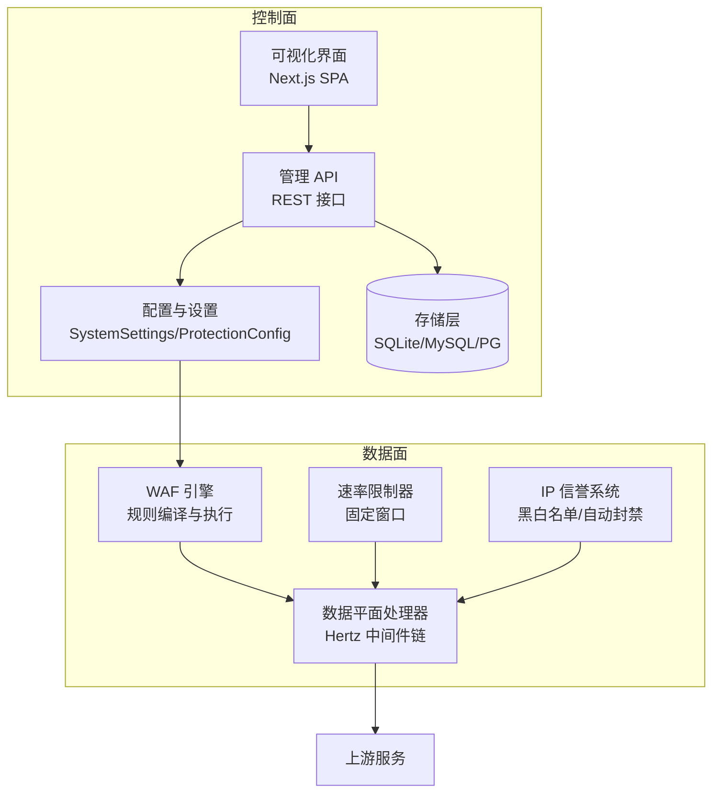
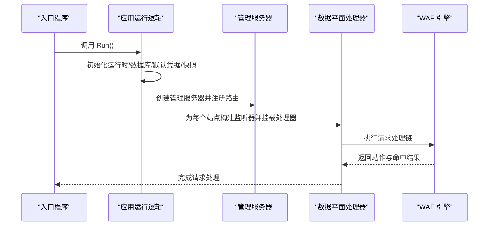
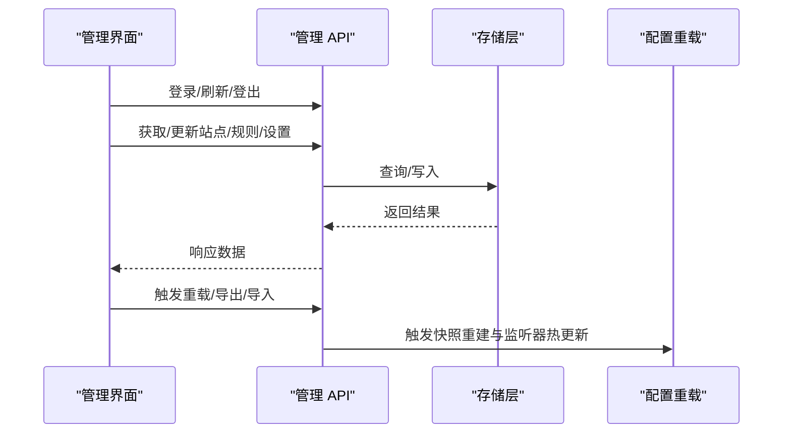
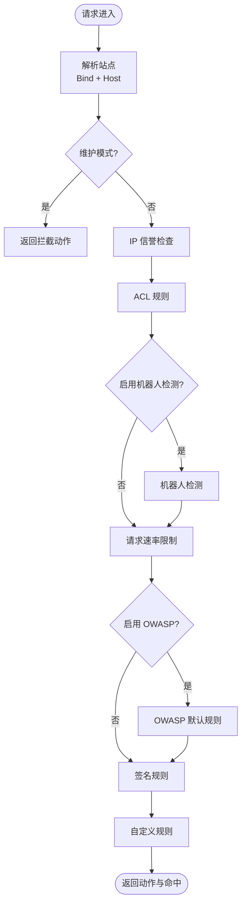
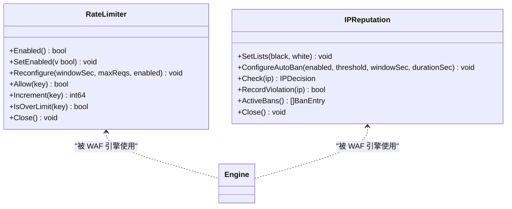
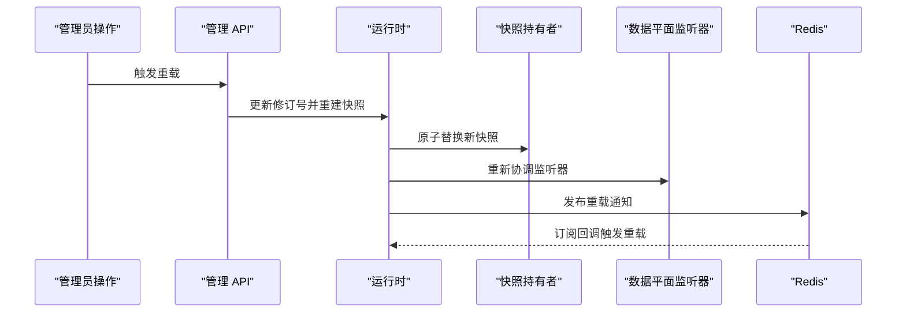
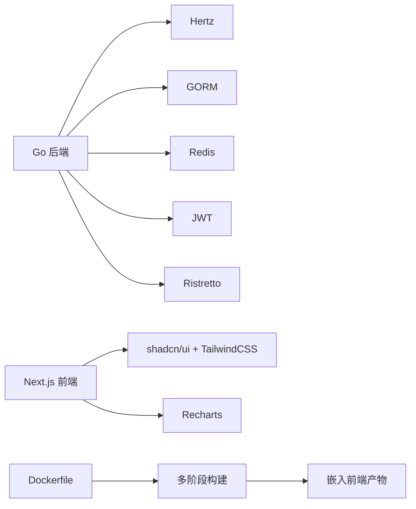

# 项目介绍

<cite>
**本文引用的文件**
- [README.md](file://README.md)
- [cmd/main.go](file://cmd/main.go)
- [internal/app/server.go](file://internal/app/server.go)
- [internal/core/config.go](file://internal/core/config.go)
- [internal/core/runtime.go](file://internal/core/runtime.go)
- [internal/core/engine/engine.go](file://internal/core/engine/engine.go)
- [internal/snapshot/snapshot.go](file://internal/snapshot/snapshot.go)
- [internal/admin/router.go](file://internal/admin/router.go)
- [frontend/README.md](file://frontend/README.md)
- [frontend/package.json](file://frontend/package.json)
- [go.mod](file://go.mod)
- [Dockerfile](file://Dockerfile)
</cite>

## 目录
1. [简介](#简介)
2. [项目结构](#项目结构)
3. [核心组件](#核心组件)
4. [架构总览](#架构总览)
5. [详细组件分析](#详细组件分析)
6. [依赖关系分析](#依赖关系分析)
7. [性能考量](#性能考量)
8. [故障排查指南](#故障排查指南)
9. [结论](#结论)
10. [附录](#附录)

## 简介
My-OpenWaf 是一个基于 Go 语言开发的高性能 Web 应用防火墙（WAF）系统，专注于为企业提供强大而灵活的 Web 安全防护能力。它采用“控制面 + 数据面”的分层设计：控制面负责可视化管理与配置下发，数据面负责高并发请求处理与实时防护。系统支持多站点独立监听、可视化管理界面、热重载配置、分布式节点同步、OWASP 标准规则、速率限制、IP 黑白名单与自动封禁、机器人检测、维护模式与自定义拦截页等核心能力。

本项目适合不同技术背景的用户：
- 初学者：通过可视化界面快速上手，理解 WAF 的基本概念与使用方式
- 运维工程师：利用热重载与分布式同步机制，实现安全策略的动态调整与跨节点一致性
- 开发者：基于清晰的模块化架构与可扩展的规则引擎，定制化安全策略与防护逻辑

## 项目结构
项目采用前后端分离与模块化组织：
- 后端（Go）：控制面（REST API + 可视化静态资源）、数据面（HTTP 处理器链）、核心引擎（规则编译与执行）、存储与迁移、缓存与事件写入、生命周期管理等
- 前端（Next.js）：基于 shadcn/ui 的管理界面，覆盖站点、证书、策略、规则、安全事件、仪表盘等功能页面
- 构建与部署：Docker 多阶段构建，前端产物嵌入后端，运行时以 SQLite 为默认数据库，支持 MySQL/PostgreSQL

图表来源
- [internal/admin/router.go:29-137](file://internal/admin/router.go#L29-L137)
- [internal/app/server.go:245-278](file://internal/app/server.go#L245-L278)
- [internal/core/engine/engine.go:15-106](file://internal/core/engine/engine.go#L15-L106)
- [internal/waf/ratelimit.go:9-117](file://internal/waf/ratelimit.go#L9-L117)
- [internal/waf/iprep.go:18-243](file://internal/waf/iprep.go#L18-L243)

章节来源
- [cmd/main.go:1-10](file://cmd/main.go#L1-L10)
- [go.mod:1-58](file://go.mod#L1-L58)
- [Dockerfile:1-36](file://Dockerfile#L1-L36)
- [frontend/README.md:1-22](file://frontend/README.md#L1-L22)
- [frontend/package.json:1-45](file://frontend/package.json#L1-L45)

## 核心组件
- 控制面（Admin Control Plane）
  - 管理 API：提供认证、站点、证书、策略、规则、系统设置、安全事件、仪表盘等接口
  - 可视化界面：基于 Next.js 的 SPA，覆盖多类管理页面
  - 配置与持久化：SystemSettings 与 ProtectionConfig 存储全局保护策略；Site 模型承载站点级配置
- 数据面（Data Plane）
  - 请求处理链：基于 Hertz 的中间件链，按阶段执行 WAF 规则
  - WAF 引擎：解析站点、执行维护检查、IP 信誉、ACL、机器人检测、速率限制、OWASP 默认规则、签名与自定义规则
  - 速率限制与 IP 信誉：固定窗口计数与黑名单/白名单、自动封禁
- 存储与迁移：GORM 支持 SQLite/MySQL/PostgreSQL，内置迁移与种子数据
- 生命周期与热重载：监听配置变更，动态增删站点监听，支持 Redis 分布式通知

章节来源
- [internal/admin/router.go:29-137](file://internal/admin/router.go#L29-L137)
- [internal/store/models.go:95-147](file://internal/store/models.go#L95-L147)
- [internal/store/models.go:246-289](file://internal/store/models.go#L246-L289)
- [internal/core/engine/engine.go:15-106](file://internal/core/engine/engine.go#L15-L106)
- [internal/waf/ratelimit.go:9-117](file://internal/waf/ratelimit.go#L9-L117)
- [internal/waf/iprep.go:18-243](file://internal/waf/iprep.go#L18-L243)

## 架构总览
My-OpenWaf 的整体架构分为三层：
- 入口与启动：入口函数调用应用运行逻辑，初始化运行时、数据库迁移、默认凭据生成、快照加载与事件写入器
- 控制面：Hertz 管理服务器，注册认证与各类管理 API，并挂载前端静态资源
- 数据面：按站点维度创建独立监听器，每个监听器绑定数据平面处理器，执行 WAF 引擎与各阶段规则

图表来源
- [cmd/main.go:7-9](file://cmd/main.go#L7-L9)
- [internal/app/server.go:33-280](file://internal/app/server.go#L33-L280)
- [internal/admin/router.go:29-137](file://internal/admin/router.go#L29-L137)
- [internal/core/engine/engine.go:44-106](file://internal/core/engine/engine.go#L44-L106)

## 详细组件分析

### 控制面：管理 API 与可视化界面
- 管理 API 设计
  - 认证：登录、刷新、登出，使用 JWT 与 API Key
  - 资源管理：站点、证书、策略、规则、系统设置、IP 名单、安全事件、仪表盘
  - 操作约定：仅使用 GET/POST，更新与删除通过 POST 路径扩展实现，简化反向代理与 CORS
- 可视化界面
  - 基于 Next.js 与 shadcn/ui 组件库，覆盖站点管理、规则编辑、安全事件查看、仪表盘等
  - 支持主题切换、响应式布局与现代化交互

图表来源
- [internal/admin/router.go:43-137](file://internal/admin/router.go#L43-L137)
- [frontend/README.md:1-22](file://frontend/README.md#L1-L22)
- [frontend/package.json:14-43](file://frontend/package.json#L14-L43)

章节来源
- [internal/admin/router.go:29-137](file://internal/admin/router.go#L29-L137)
- [frontend/README.md:1-22](file://frontend/README.md#L1-L22)
- [frontend/package.json:14-43](file://frontend/package.json#L14-L43)

### 数据面：WAF 引擎与处理流程
- 站点解析与维护检查
  - 基于监听地址与 Host 解析目标站点，支持通配符匹配与回退策略
  - 全局或站点级维护模式优先拦截
- 规则阶段顺序
  - IP 信誉（白名单短路、黑名单直接拦截）
  - ACL
  - 机器人检测（恶意工具早期阻断）
  - 请求速率限制
  - OWASP 默认规则
  - 签名与自定义规则
- 动作与观测
  - 动作为允许/拦截/观察，支持对拦截进行统计与事件记录

图表来源
- [internal/core/engine/engine.go:44-106](file://internal/core/engine/engine.go#L44-L106)
- [internal/snapshot/snapshot.go:74-96](file://internal/snapshot/snapshot.go#L74-L96)

章节来源
- [internal/core/engine/engine.go:15-146](file://internal/core/engine/engine.go#L15-L146)
- [internal/snapshot/snapshot.go:21-105](file://internal/snapshot/snapshot.go#L21-L105)

### 速率限制与 IP 信誉
- 速率限制
  - 固定窗口计数，按客户端 IP + 主机键控，支持运行时重新配置
  - 提供错误率统计（上游响应后增量），支持按 4xx/5xx/拦截计数
- IP 信誉
  - 黑/白名单即时生效，支持 CIDR 与单 IP
  - 自动封禁：在时间窗口内累计违规次数达到阈值后封禁指定时长，周期性清理过期封禁

图表来源
- [internal/waf/ratelimit.go:9-117](file://internal/waf/ratelimit.go#L9-L117)
- [internal/waf/iprep.go:18-243](file://internal/waf/iprep.go#L18-L243)
- [internal/core/engine/engine.go:15-106](file://internal/core/engine/engine.go#L15-L106)

章节来源
- [internal/waf/ratelimit.go:9-117](file://internal/waf/ratelimit.go#L9-L117)
- [internal/waf/iprep.go:18-243](file://internal/waf/iprep.go#L18-L243)

### 配置与快照、热重载与分布式同步
- 快照（Snapshot）
  - 不可变视图，原子指针替换，包含站点映射、全局默认拦截页、SNI 证书映射与保护配置
  - 站点匹配支持精确 Host、通配符与回退策略
- 热重载
  - 修订号递增、重建快照、更新速率限制与 IP 信誉配置、重新协调监听器（新增/重启因配置漂移）
- 分布式同步
  - Redis 发布/订阅：任一节点触发重载后，其他节点订阅回调自动同步

图表来源
- [internal/app/server.go:203-243](file://internal/app/server.go#L203-L243)
- [internal/snapshot/snapshot.go:52-105](file://internal/snapshot/snapshot.go#L52-L105)

章节来源
- [internal/app/server.go:203-243](file://internal/app/server.go#L203-L243)
- [internal/snapshot/snapshot.go:52-105](file://internal/snapshot/snapshot.go#L52-L105)

### 存储模型与保护配置
- 站点模型（Site）
  - 包含监听地址、网络协议、TLS 开关与证书、最小/最大 TLS 版本、ALPN、转发配置、最大请求体、上游 TLS 设置、维护模式与拦截页等
- 系统设置（SystemSettings）
  - 用于存储键值对配置，如 JWT 密钥、保护配置 ProtectionConfig
- 保护配置（ProtectionConfig）
  - 请求/错误速率限制、OWASP 开关与敏感度、全局维护模式、机器人检测、IP 自动封禁、等待室与登录安全策略等

章节来源
- [internal/store/models.go:95-147](file://internal/store/models.go#L95-L147)
- [internal/store/models.go:149-155](file://internal/store/models.go#L149-L155)
- [internal/store/models.go:246-313](file://internal/store/models.go#L246-L313)

## 依赖关系分析
- 后端依赖
  - Web 框架：Hertz（高性能 HTTP 框架）
  - ORM：GORM（SQLite/MySQL/PostgreSQL）
  - 缓存：Ristretto（内存缓存）
  - Redis：go-redis（发布/订阅与未来扩展）
  - 加密与令牌：golang-jwt（JWT）
- 前端依赖
  - Next.js 16、React 19、TailwindCSS、Recharts、shadcn/ui 等
- 构建与运行
  - Docker 多阶段构建，前端产物嵌入后端，运行时默认 SQLite，暴露管理端口

图表来源
- [go.mod:5-16](file://go.mod#L5-L16)
- [frontend/package.json:14-43](file://frontend/package.json#L14-L43)
- [Dockerfile:1-36](file://Dockerfile#L1-L36)

章节来源
- [go.mod:1-58](file://go.mod#L1-L58)
- [frontend/package.json:14-43](file://frontend/package.json#L14-L43)
- [Dockerfile:1-36](file://Dockerfile#L1-L36)

## 性能考量
- 高并发处理
  - 使用 Hertz 作为数据平面处理器，具备高性能与低延迟特性
- 内存缓存
  - Ristretto 用于热点数据缓存，降低数据库压力
- 固定窗口速率限制
  - 实现简单、内存占用低，适合高 QPS 场景
- 原子快照与无锁读取
  - 快照不可变，读路径零锁竞争，提升吞吐
- 事件异步写入
  - 安全事件批量异步写入，避免阻塞请求处理

## 故障排查指南
- 首次运行凭据
  - 首次启动会打印管理员用户名/密码与 API Token，请妥善保存
- 数据库连接
  - 确认环境变量驱动与 DSN 正确；默认 SQLite 路径位于数据目录
- 管理端口与静态资源
  - 管理服务器默认绑定地址可通过环境变量配置；前端静态资源在容器中已嵌入
- 重载失败
  - 检查数据库迁移是否成功、快照重建日志、Redis 分布式同步状态
- TLS 与证书
  - 确认站点 TLS 开关、证书与 SNI 配置正确，检查最小/最大 TLS 版本与 ALPN

章节来源
- [internal/app/server.go:55-68](file://internal/app/server.go#L55-L68)
- [internal/core/config.go:31-66](file://internal/core/config.go#L31-L66)
- [internal/admin/router.go:139-153](file://internal/admin/router.go#L139-L153)

## 结论
My-OpenWaf 以清晰的控制面与数据面分层、可热重载的快照机制、完善的可视化管理界面为核心，为企业提供了即开即用且可扩展的 Web 安全解决方案。其模块化设计便于二次开发与定制，结合分布式同步能力，能够满足多站点、多节点场景下的统一安全治理需求。

## 附录
- 设计目标
  - 高性能：数据面基于 Hertz，规则链轻量高效
  - 易运维：可视化界面、热重载、分布式同步
  - 可扩展：规则引擎、站点级隔离、模块化组件
- 核心价值
  - 降低企业 Web 安全门槛，提升防护效率与可观测性
  - 支持复杂业务场景（多站点、多租户、灰度与蓝绿发布）
- 应用场景
  - 电商、金融、政务等对安全性与可用性要求高的网站
  - 需要精细化规则控制与审计留痕的合规场景
- 发展历程与版本信息
  - 当前版本：基于 Go 1.25.x 与 Next.js 16 的稳定实现
  - 版本演进：持续完善规则引擎、增强可视化与可观测性
- 社区支持
  - 采用 MIT 许可，欢迎贡献与反馈