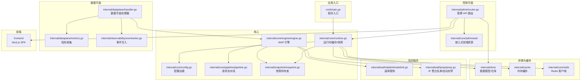
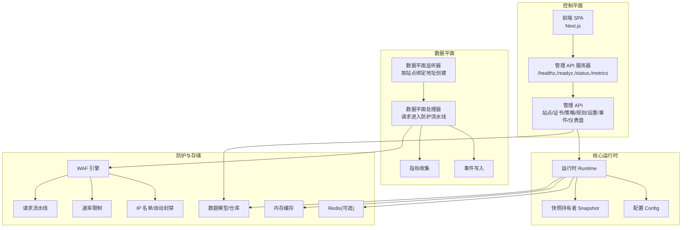
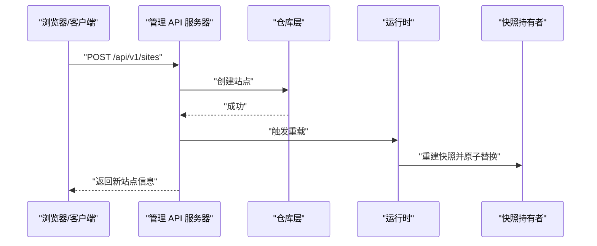
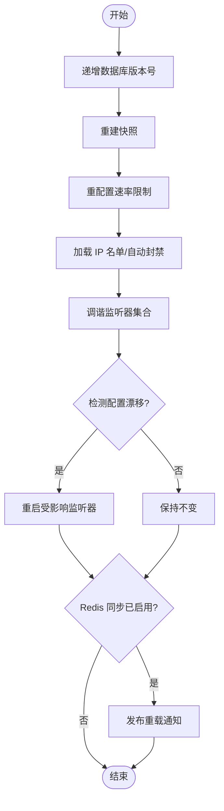
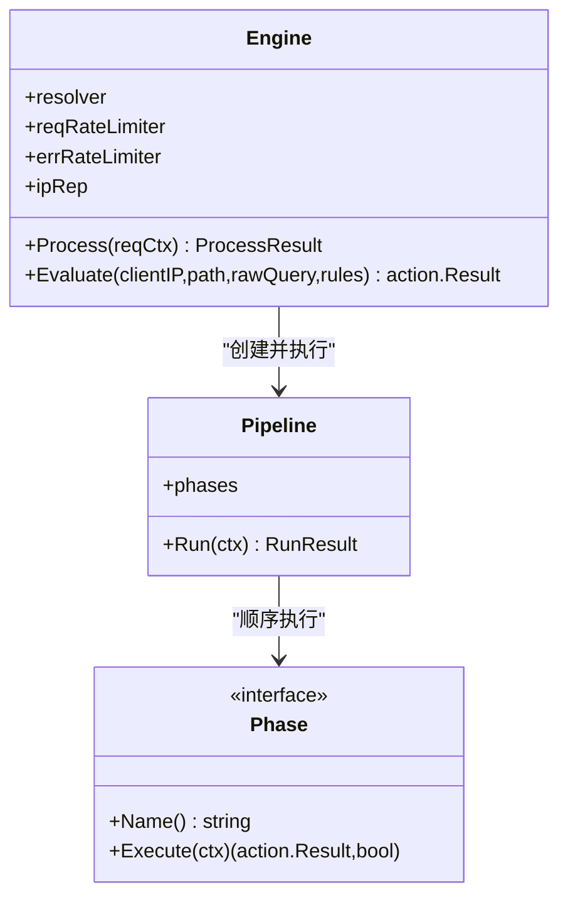
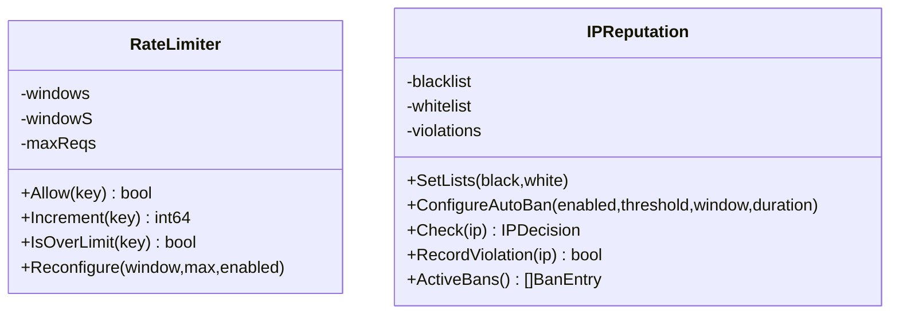
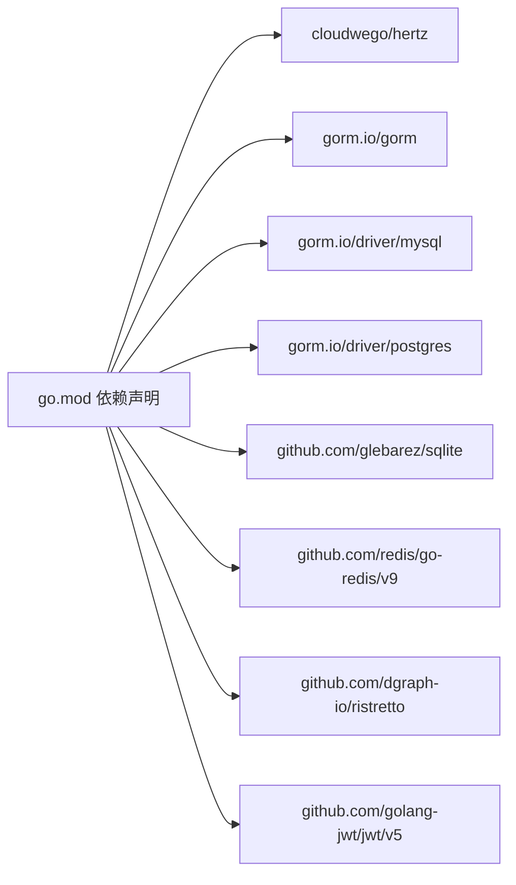

# 项目概述

<cite>
**本文档引用的文件**
- [README.md](file://README.md)
- [cmd/main.go](file://cmd/main.go)
- [internal/app/server.go](file://internal/app/server.go)
- [internal/core/config.go](file://internal/core/config.go)
- [internal/core/runtime.go](file://internal/core/runtime.go)
- [internal/snapshot/snapshot.go](file://internal/snapshot/snapshot.go)
- [internal/core/engine/engine.go](file://internal/core/engine/engine.go)
- [internal/admin/router.go](file://internal/admin/router.go)
- [internal/core/pipeline/pipeline.go](file://internal/core/pipeline/pipeline.go)
- [internal/waf/ratelimit/ratelimit.go](file://internal/waf/ratelimit/ratelimit.go)
- [internal/waf/iprep/iprep.go](file://internal/waf/iprep/iprep.go)
- [frontend/README.md](file://frontend/README.md)
- [frontend/package.json](file://frontend/package.json)
- [Dockerfile](file://Dockerfile)
- [go.mod](file://go.mod)
</cite>

> **子页面索引**

本模块按受众与深度将子页面划分为三类：**入门与概览**、**技术深入**、**开发者资源**。

#### 入门与概览
- [项目介绍](./项目介绍.md) — 项目背景、目标受众、整体结构与核心组件概览
- [快速开始](./快速开始.md) — 环境准备、构建、Docker 部署与首次登录的完整上手指南

#### 技术深入
- [技术架构](./技术架构.md) — 控制面与数据面的分层架构、组件关系、数据流向与关键技术选型说明
- [核心特性](./核心特性.md) — 六大核心特性的实现原理、使用场景、优势与配置要点

#### 开发者资源
- [开发者指南](./开发者指南.md) — 环境搭建、代码贡献、测试、调试、性能分析与 WASM 挑战模块开发指南

---

> **模块架构概述**

`项目概述` 模块是了解 My-OpenWaf 的第一站，采用"由浅入深"的组织方式：从项目背景与快速上手切入，逐步深入到技术架构与核心特性，最后提供面向开发者的完整指南。五个子页面共享统一的"控制面 + 数据面"双服务器架构主题，覆盖项目介绍、技术架构解析、特性详解、快速开始与开发者工作流，形成完整的认知路径。

## 目录
1. [简介](#简介)
2. [项目结构](#项目结构)
3. [核心组件](#核心组件)
4. [架构总览](#架构总览)
5. [详细组件分析](#详细组件分析)
6. [依赖分析](#依赖分析)
7. [性能考虑](#性能考虑)
8. [故障排除指南](#故障排除指南)
9. [结论](#结论)
10. [附录](#附录)

## 简介
My-OpenWaf 是一个基于 Go 语言开发的高性能 Web 应用防火墙系统，采用双服务器架构：控制平面（管理接口）与数据平面（流量处理）。它支持多站点防护、可视化管理界面、热重载配置、分布式同步等能力，适用于需要细粒度站点级防护与集中管理的企业与云环境。

- 项目目标：提供可扩展、可观测、易运维的 Web 防火墙解决方案，兼顾初学者易用性与高级用户的深度定制需求。
- 核心特性：
  - 多站点防护：每个站点独立监听、独立配置、独立热启停。
  - 可视化管理界面：基于 Next.js 的 SPA 前端，覆盖站点、规则、策略、证书、事件等管理场景。
  - 热重载配置：通过快照与生命周期管理实现无损配置变更与监听器动态调整。
  - 分布式同步：基于 Redis 的配置同步通道，支持多节点一致性与快速生效。
  - 完整防护链：IP 名单、速率限制、OWASP 规则集、自定义规则、机器人检测等。
- 技术栈与架构决策：
  - 后端：Go + Hertz（高性能 HTTP 框架）、GORM（数据库抽象）、SQLite/MySQL/PostgreSQL 支持。
  - 缓存与分布式：Ristretto 内存缓存、Redis（可选）。
  - 前端：Next.js 16 + shadcn/ui，构建产物嵌入后端，便于单体部署。
  - 容器化：多阶段 Docker 构建，分离前端构建与后端编译，最终运行在 Alpine 基础镜像上。

## 项目结构
项目采用按职责分层与功能模块化的组织方式：
- cmd：应用入口，调用 internal/app 的 Run 函数启动服务。
- internal：核心业务代码
  - app：应用主流程，初始化运行时、加载快照、注册控制平面与数据平面、热重载与分布式同步。
  - core：核心基础设施（配置、运行时、引擎、流水线、健康检查、生命周期管理）。
  - admin：控制平面 API 与前端静态资源挂载。
  - dataplane：数据平面处理器、指标、事件写入、SSE/WebSocket。
  - waf：规则引擎与防护组件（速率限制、IP 黑白名单、OWASP 规则集等）。
  - store：数据模型与仓库（站点、规则、策略、证书、系统设置等）。
  - snapshot：不可变快照持有者，用于数据平面安全读取。
  - observability：可观测性（事件写入、归档、Prometheus 指标）。
  - cache/redis：缓存与分布式键值存储。
  - streaming/proxy/upstream：上游代理与传输层抽象。
- frontend：Next.js 前端工程，包含页面、组件库、UI 组件与工具函数。
- scripts：构建脚本。
- 根目录：Dockerfile、go.mod、go.sum、README 等。

图表来源
- [cmd/main.go:1-10](file://cmd/main.go#L1-L10)
- [internal/app/server.go:33-280](file://internal/app/server.go#L33-L280)
- [internal/core/runtime.go:27-80](file://internal/core/runtime.go#L27-L80)
- [internal/core/engine/engine.go:24-106](file://internal/core/engine/engine.go#L24-L106)
- [internal/admin/router.go:36-137](file://internal/admin/router.go#L36-L137)

章节来源
- [cmd/main.go:1-10](file://cmd/main.go#L1-L10)
- [internal/app/server.go:33-280](file://internal/app/server.go#L33-L280)
- [internal/core/config.go:31-66](file://internal/core/config.go#L31-L66)
- [internal/core/runtime.go:27-80](file://internal/core/runtime.go#L27-L80)
- [internal/snapshot/snapshot.go:52-105](file://internal/snapshot/snapshot.go#L52-L105)
- [internal/admin/router.go:36-137](file://internal/admin/router.go#L36-L137)
- [frontend/README.md:1-22](file://frontend/README.md#L1-L22)

## 核心组件
- 运行时（Runtime）
  - 负责从环境变量加载配置，打开数据库连接，可选 Redis 客户端，初始化内存缓存与快照持有者。
  - 提供快照热加载能力，维护当前版本号并缓存快照以提升读性能。
- 快照（Snapshot）
  - 不可变快照对象，包含站点映射、默认拦截页、SNI 证书映射以及全局保护配置。
  - 提供站点匹配算法，支持精确匹配、通配符与回退策略。
- 引擎（Engine）
  - 将请求上下文送入多阶段流水线，依次执行 IPReputation、AntiReplay、ACL、OWASP、CVE、BotDetection、RequestRateLimit、Signature、Custom。
  - 支持评估模式（仅规则链）与维护模式短路。
- 流水线（Pipeline）
  - 定义统一的阶段接口，顺序执行；非 Challenge 终端动作立即短路，Challenge 类动作会暂存并允许后续更高优先级终端动作覆盖，观察命中用于日志记录。
- 速率限制（RateLimiter）
  - 固定窗口计数器，按客户端 IP + 主机头组合计数，支持动态开关与重配置。
- IP 黑白名单与自动封禁（IPReputation）
  - 支持 CIDR/单 IP 条目、过期时间、自动封禁阈值与窗口、封禁时长。
  - 提供活跃封禁列表查询与清理协程。
- 控制平面（Admin）
  - 提供认证、站点、证书、策略、规则、系统设置、安全事件、仪表盘等 REST API。
  - 挂载前端静态资源，支持 SPA 路由回退。
- 数据平面（Dataplane）
  - 每个站点绑定地址对应一个 Hertz 实例，支持 TLS 终止与 SNI 证书。
  - 通过事件写入与指标收集实现可观测性。

章节来源
- [internal/core/runtime.go:27-99](file://internal/core/runtime.go#L27-L99)
- [internal/snapshot/snapshot.go:52-105](file://internal/snapshot/snapshot.go#L52-L105)
- [internal/core/engine/engine.go:24-106](file://internal/core/engine/engine.go#L24-L106)
- [internal/core/pipeline/pipeline.go:42-66](file://internal/core/pipeline/pipeline.go#L42-L66)
- [internal/waf/ratelimit/ratelimit.go:19-126](file://internal/waf/ratelimit/ratelimit.go#L19-L126)
- [internal/waf/iprep/iprep.go:19-207](file://internal/waf/iprep/iprep.go#L19-L207)
- [internal/admin/router.go:36-137](file://internal/admin/router.go#L36-L137)

## 架构总览
My-OpenWaf 采用"控制平面 + 数据平面"的双服务器架构：
- 控制平面：Hertz 管理 API 服务器，提供认证、配置 CRUD、仪表盘与前端静态资源。
- 数据平面：按站点维度创建独立监听器，每个监听器封装数据平面处理器，负责实时请求处理与防护。
- 配置与状态：
  - 配置变更通过数据库版本号递增触发快照重建与热重载。
  - 可选 Redis 用于分布式通知，其他节点订阅后同步更新。
  - 内存缓存加速快照读取，避免每次重建。
- 可观测性：
  - 事件异步批量写入数据库，支持定时归档。
  - Prometheus 兼容指标暴露，支持实时 QPS、攻击统计等。
- 前端集成：
  - 前端构建产物嵌入到后端，控制平面直接提供静态文件与 SPA 回退。

图表来源
- [internal/app/server.go:245-279](file://internal/app/server.go#L245-L279)
- [internal/admin/router.go:36-137](file://internal/admin/router.go#L36-L137)
- [internal/core/engine/engine.go:24-106](file://internal/core/engine/engine.go#L24-L106)
- [internal/waf/ratelimit/ratelimit.go:19-126](file://internal/waf/ratelimit/ratelimit.go#L19-L126)
- [internal/waf/iprep/iprep.go:19-207](file://internal/waf/iprep/iprep.go#L19-L207)

## 详细组件分析

### 控制平面与管理 API
- 路由组织：使用 Hertz Group 对 API 进行分组，认证路由无需中间件，受保护路由通过 JWT 中间件校验。
- 资源操作：遵循 GET/POST 约定，更新与删除通过 POST /resource/:id/update 与 POST /resource/:id/delete 实现，简化反向代理与 CORS。
- 前端集成：未命中 API 的路径回退到前端静态文件，实现 SPA 单页应用体验。
- 关键接口示例（路径参考）：
  - 登录/刷新/登出：/api/v1/auth/login、/api/v1/auth/refresh、/api/v1/auth/logout
  - 站点管理：/api/v1/sites、/api/v1/sites/:id、/api/v1/sites/:id/start、/api/v1/sites/:id/stop
  - 规则管理：/api/v1/rules、/api/v1/rules/test、/api/v1/rules/validate、/api/v1/rules/import
  - 系统设置与保护设置：/api/v1/settings、/api/v1/protection-settings
  - 安全事件：/api/v1/security-events、/api/v1/security-events/stats、/api/v1/security-events/timeline
  - 仪表盘摘要：/api/v1/dashboard/summary
  - 快照重载：/api/v1/reload

图表来源
- [internal/admin/router.go:62-71](file://internal/admin/router.go#L62-L71)
- [internal/core/runtime.go:82-99](file://internal/core/runtime.go#L82-L99)
- [internal/snapshot/snapshot.go:103-105](file://internal/snapshot/snapshot.go#L103-L105)

章节来源
- [internal/admin/router.go:36-137](file://internal/admin/router.go#L36-L137)

### 数据平面与监听器热重载
- 站点监听器：每个启用且配置有效的站点都会创建独立的 Hertz 服务器实例，名称包含站点 ID 与绑定地址，支持 TLS 终止与 SNI 证书。
- 配置漂移检测：通过指纹函数计算监听器配置哈希，当绑定地址、TLS 开关、证书内容或 SNI 列表变化时自动重启受影响监听器。
- 热重载流程：
  - 数据库版本号递增，运行时重建快照。
  - 更新速率限制与 IP 名单配置。
  - 调谐监听器集合，新增/重启/移除。
  - 可选通过 Redis 发布重载通知，其他节点同步。

图表来源
- [internal/app/server.go:203-243](file://internal/app/server.go#L203-L243)
- [internal/app/server.go:139-201](file://internal/app/server.go#L139-L201)
- [internal/app/server.go:434-457](file://internal/app/server.go#L434-L457)

章节来源
- [internal/app/server.go:139-201](file://internal/app/server.go#L139-L201)
- [internal/app/server.go:203-243](file://internal/app/server.go#L203-L243)
- [internal/app/server.go:434-457](file://internal/app/server.go#L434-L457)

### WAF 引擎与请求处理流水线
- 请求上下文：包含绑定地址、客户端 IP、方法、路径、查询参数、头部、主体等。
- 阶段顺序：
  1) IPReputation：白名单短路放行，黑名单直接拦截。
  2) AntiReplay：非重复请求检查。
  3) ACL：基于站点规则的访问控制。
  4) OWASP 规则集：可选启用的标准规则族。
  5) CVE 检测：特定漏洞检测。
  6) BotDetection：识别恶意工具与高风险流量。
  7) RequestRateLimit：按窗口与阈值控制。
  8) Signature：签名规则。
  9) Custom：用户自定义规则。
- 终止条件：Drop、Intercept、RateLimit、Redirect 等非 Challenge 终端动作立即返回；Challenge 类动作暂存并允许后续更高优先级终端动作覆盖；Observe 命中用于日志记录。

图表来源
- [internal/core/engine/engine.go:24-106](file://internal/core/engine/engine.go#L24-L106)
- [internal/core/pipeline/pipeline.go:42-66](file://internal/core/pipeline/pipeline.go#L42-L66)

章节来源
- [internal/core/engine/engine.go:44-106](file://internal/core/engine/engine.go#L44-L106)
- [internal/core/pipeline/pipeline.go:9-23](file://internal/core/pipeline/pipeline.go#L9-L23)

### 速率限制与 IP 名单
- 速率限制：
  - 固定窗口计数器，键为"客户端 IP + 主机头"，支持动态开关与重配置。
  - 清理协程定期回收过期窗口。
- IP 名单与自动封禁：
  - 白名单短路放行，黑名单直接拦截。
  - 自动封禁基于违规计数与时间窗口，支持配置阈值、窗口与封禁时长。
  - 提供活跃封禁列表查询与过期清理。

图表来源
- [internal/waf/ratelimit/ratelimit.go:19-126](file://internal/waf/ratelimit/ratelimit.go#L19-L126)
- [internal/waf/iprep/iprep.go:19-207](file://internal/waf/iprep/iprep.go#L19-L207)

章节来源
- [internal/waf/ratelimit/ratelimit.go:19-126](file://internal/waf/ratelimit/ratelimit.go#L19-L126)
- [internal/waf/iprep/iprep.go:19-207](file://internal/waf/iprep/iprep.go#L19-L207)

### 前端与构建
- 前端采用 Next.js 16 与 shadcn/ui，提供丰富的 UI 组件与主题支持。
- 构建脚本与包管理：包含开发、构建、启动、格式化与类型检查脚本。
- Docker 多阶段构建：先构建前端产物，再编译 Go 后端并将前端输出嵌入到后端资源中，最终运行在 Alpine 上。

章节来源
- [frontend/README.md:1-22](file://frontend/README.md#L1-L22)
- [frontend/package.json:1-45](file://frontend/package.json#L1-L45)
- [Dockerfile:1-36](file://Dockerfile#L1-L36)

## 依赖分析
- Go 模块依赖（节选）：
  - Hertz：高性能 HTTP 框架，用于控制平面与数据平面监听器。
  - GORM：数据库 ORM，支持 SQLite/MySQL/PostgreSQL。
  - Redis：go-redis 客户端，用于可选的分布式缓存与配置同步。
  - Ristretto：高性能内存缓存，用于快照与热点数据缓存。
  - JWT：用于管理 API 认证。
- 外部集成点：
  - 数据库：通过 DSN 与驱动选择支持多种后端。
  - Redis：可选启用，用于分布式共享状态与配置同步。
  - 前端：构建产物嵌入后端，控制平面提供静态文件与 SPA 回退。

图表来源
- [go.mod:5-16](file://go.mod#L5-L16)

章节来源
- [go.mod:5-16](file://go.mod#L5-L16)

## 性能考虑
- 快照与缓存：运行时维护快照与内存缓存，避免每次重建快照带来的开销，提升数据平面读取性能。
- 流水线短路：一旦出现拦截动作立即返回，减少后续阶段开销。
- 并发与锁：速率限制与 IP 名单使用原子与互斥锁，降低竞争开销。
- 清理与回收：速率限制与 IP 名单的清理协程定期回收过期数据，防止内存膨胀。
- 监听器隔离：按站点创建独立监听器，便于水平扩展与资源隔离。
- 前端内嵌：构建产物内嵌后端，减少静态资源访问延迟。

## 故障排除指南
- 初始化失败
  - 现象：核心初始化或自动迁移失败，进程退出。
  - 排查：查看日志中的错误信息，确认数据库驱动与 DSN 是否正确，数据目录权限是否足够。
- 首次运行凭据
  - 现象：首次启动打印管理员用户名与密码或 API Token。
  - 处理：妥善保存凭据，后续可通过管理 API 修改。
- 快照重建失败
  - 现象：初始快照构建或重载失败。
  - 处理：检查数据库连接、系统设置与站点配置，确保所有必需字段完整。
- 监听器未启动或频繁重启
  - 现象：站点监听器未启动或因配置漂移被重启。
  - 处理：检查站点绑定地址、TLS 配置与证书内容，确认指纹计算结果是否发生变化。
- 速率限制不生效
  - 现象：请求未被限流。
  - 处理：确认速率限制开关、窗口与阈值配置，检查重配置是否成功。
- IP 名单未生效
  - 现象：白名单未放行或黑名单未拦截。
  - 处理：确认条目格式（CIDR/单 IP）、过期时间与自动封禁配置，检查加载流程。
- Redis 同步异常
  - 现象：多节点配置不同步。
  - 处理：确认 Redis 地址、密码与 DB 选择，检查订阅回调是否正常执行。

章节来源
- [internal/app/server.go:37-47](file://internal/app/server.go#L37-L47)
- [internal/app/server.go:70-73](file://internal/app/server.go#L70-L73)
- [internal/app/server.go:227-243](file://internal/app/server.go#L227-L243)
- [internal/waf/ratelimit/ratelimit.go:34-56](file://internal/waf/ratelimit/ratelimit.go#L34-L56)
- [internal/waf/iprep/iprep.go:64-84](file://internal/waf/iprep/iprep.go#L64-L84)

## 结论
My-OpenWaf 通过清晰的双服务器架构、可热重载的快照机制与完善的防护流水线，提供了从入门到进阶的完整 Web 防火墙解决方案。控制平面提供直观的可视化管理与 REST API，数据平面以高并发与低延迟处理请求，结合可观测性与分布式同步，满足多站点、多租户与高可用场景的需求。建议在生产环境中启用 Redis 以获得更好的分布式一致性，并根据业务流量调整速率限制与保护策略。

## 附录
- 环境变量与配置
  - 数据库：驱动与 DSN、数据目录。
  - Redis：地址、密码、DB。
  - 管理端口：控制平面监听地址。
  - JWT 密钥：优先从环境变量读取，否则从数据库生成。
- 前端开发
  - 使用 Next.js 16 与 shadcn/ui，支持组件添加与导入。
- 容器化
  - 多阶段构建，前端产物内嵌，运行时镜像精简，支持持久化数据卷。

章节来源
- [internal/core/config.go:31-66](file://internal/core/config.go#L31-L66)
- [internal/app/server.go:310-323](file://internal/app/server.go#L310-L323)
- [frontend/README.md:1-22](file://frontend/README.md#L1-L22)
- [Dockerfile:26-35](file://Dockerfile#L26-L35)
